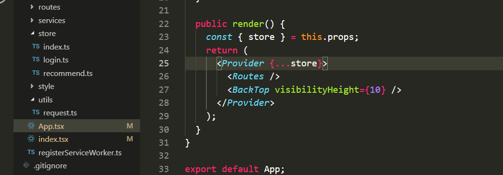

<!--
 * @Author: Rainy
 * @Github: https://github.com/Rain120
 * @Date: 2019-01-06 15:26:29
 * @LastEditTime: 2019-04-03 21:57:57
 -->

`React` + `Antd` + `Axios` 网易云音乐网页版

> 测试账号
> phone: 7480719899

### **架构图**


#### `分支`
  - `routes` 路由设置
  - `axios-config` `axios`请求配置

#### `Typescript`

[typescript中文文档](https://www.tslang.cn/docs/handbook/compiler-options.html)

#### `Error`

##### `Axios` 问题
1、跨域问题
> Q: 

`start.js`


`paths.js`


我们在`start.js`中找到`webpack`读取`proxy`的配置发现最终是读取`package.json`中的配置项`proxy`, 故: 

A: `package.json`添加下面配置
```javascript
"proxy": {
    "/api": {
      "target": "http://localhost:3000",
      "changeOrigin": true,
      "pathRewrite": {
        "^/api": "/"
      }
    }
  }
```

> 2、`Axios 404`
> 
>  

A: `package.json` 中`proxy`配置问题

> 3、`iconfont import error`

> 

A: 在引入文件之前添加`/`

> 3、`React.Children.only expected to receive a single React element child.`
>  

A: 将`Provider`内的`Dom`用一个元素包裹
